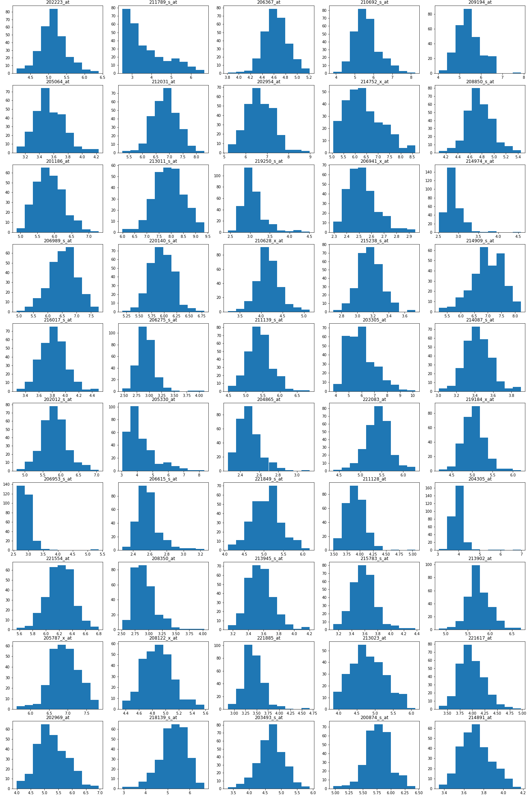
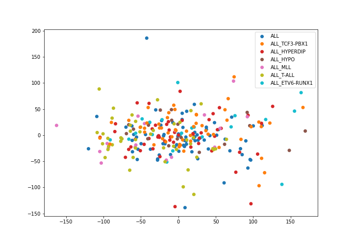
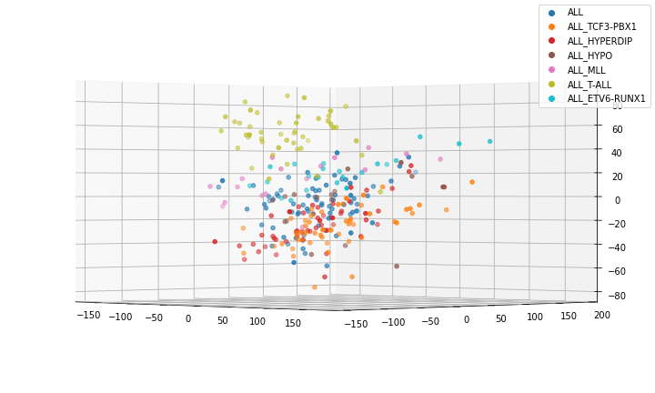
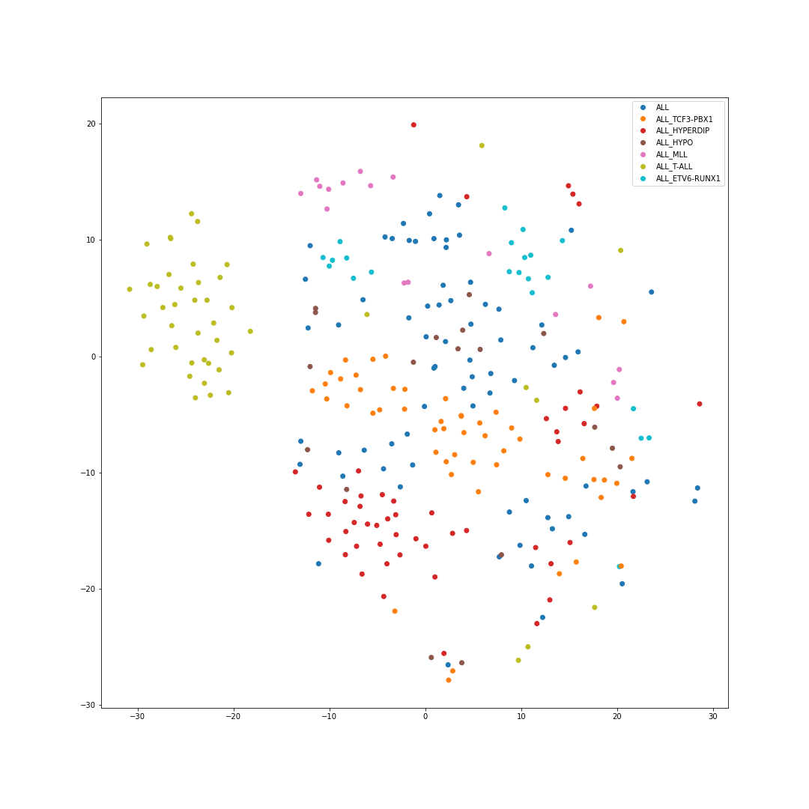
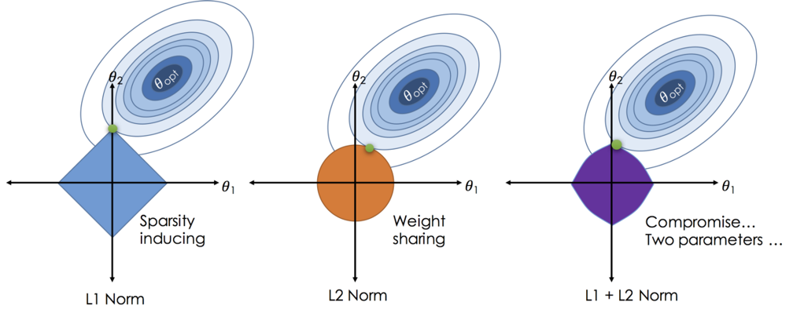

# Cancer type Predictor
-------------------------------------------------------------------------------------------------------------------------------
*As sequencing technology gets better each year there is a growing trend in diagnostics to use machince learning to quickly diagnose a patient based on the expression of their genes. Most of the research is being done by sequencing cancer cells as well as patient genomes. This generates large datasets with columns numbering in the tens of thousands, one for each gene being tested. We know from research that different cancer strains respond to treatments differently, some responding well to chemo while others do not. With machine learning we could identify if an individual has cancer or which strain of a single type of cancer we can get a head start in treatment or recommend better treatments based on the results. From this type of prediction we can also find which genes to monitor in the future to look at disease progression.
In this project I will demonstrate the how processed expression data can be used to classify cancer and with an accuracy of 88% using publicaly available data from the Gene Expression Ombnibus (GEO) published by the National Institute of Health.*

## 1. Data
-------------------------------------------------------------------------------------------------------------------------------
GEO is public functional genomics data repository supporting MIAME-compliant data submissions. Array- and sequence-based data are accepted. I looked at two array-based datasets. While sequencing data is becoming more popular both data types get processed using bioinformatics tools and the output of the data is relatively similar. Thus the techniques used in this project can be applied to both array- and sequenced-based data. The data is formatted with gene data for multiple patients as intensities or counts. The entire dataset excluding the patient identifiers and cancer labels are continuous numerical values.

  * [Gene Expession Dataset](https://www.kaggle.com/crawford/gene-expression)
  * [GSE28497](https://www.ncbi.nlm.nih.gov/geo/query/acc.cgi?acc=GSE28497)

## 2. Data Cleaning
-------------------------------------------------------------------------------------------------------------------------------

The data available on public repositories are never the raw files coming off the instrument that runs the test. Often these files have been proccessed and normalized and ready to perform research on. For the two datasets used for research here the only problems faced were making sure the class labels (the cancer variants) and sample identifiers were in a readable and distingiushable format and eventually coded, and removing any columns or data included that were not continuous variables.

## 3. EDA
-------------------------------------------------------------------------------------------------------------------------------
#### Dataset GSE28497
##### **Histograms of 50 Randomly Sampled Genes**
By looking at the histograms we can see that the data is mostly normalized and this is because the dataset provided was already preprocessed into a usable form.

##### **PCA Reduction with 2 and 3 components**
PCA analysis is used to help visualize high dimensional data, in this case tens of thousands of features per observation. These graphs are color-coded according to cancer type and although it is unclear from the 2D scatterplot we can see stratification in the 3D plot.
 
##### **T-SNE Reduction**
This type of analysis is similar to PCA in that it help with feature reduction. In this analysis we can see even clearer clusters. This may be an effective tool during modeling.

## 4. Modeling
-------------------------------------------------------------------------------------------------------------------------------

[ML notebook 1](https://github.com/srtandon/GeneExpression/blob/master/Capstone%202%20-%20Gene%20Expression%20-%20Modeling.ipynb)
[ML notebook 2](https://github.com/srtandon/GeneExpression/blob/master/GSE28497%20-%20Modeling.ipynb)

I intially worked on a simple binary classification using logistic regression. For this modeling I worked on the Gene Expression Dataset. I chose a logistic regression classification model because it was the simplest model. The metrics I used the internal score metric which show accuracy and f1 score which is the harmonic mean of precision and recall. Where precision is a measure of true positives and recall is the measure of the false negatives. With the multi-class dataset (GSE28497) I tested several models including logistic regression and found that a support vector machine (SVM) and logistic regression obtained equal accuracy but each had different errors.

> _**Note:** I chose the f1 score because the purpose of this excercise was to research the best model. Usually precision or recall should be used depending on which metric is most important to the question being asked._

I was able to obtain 100% accuracy on the binary dataset. The best score acheived on the multi-class dataset was 91.5% accuracy without being reproducible because of the random initialization of the models. The average score was 88% accuracy. To visualize this I used a confusion matrix to show predicitons vs label.

I tested a variety of hyperparameters, or tuning of the model, and learned interesting things about the data. I first tested to see if the number of columns used for the model mattered. It turns out that by testing only 6000 of 22,000+ features I could acheive maximum results. This led to using a lasso regularized model which will zero out the weights of features, effectively removing them from the equation. This is opposed to ridge regularization which shares the weights among all features. From this we could also pull out important features to track. Those features could be used as biomarkers for tracking diagnosis or potentially as therapeutic markers.

**Regularization types**

## 5. Predictions
-------------------------------------------------------------------------------------------------------------------------------
The goal of classification is to accuractly predict the label of an observation based on the model. After testing the bast Lasso-regularized logistic regression and lasso-regularized SVM.

**Confusion Matrix of Predictions on the GSE28497 dataset using Logistic Regression with Lasso regularization**

## 6. Conclusion and Next Steps
-------------------------------------------------------------------------------------------------------------------------------
In testing both logistic regression and SVM there are areas of promise. While both models acheived the same accuracy the both got different predictions wrong. Which invites the potential for building a kind of neural network. Or combining the two models using voting, in otherwords average the probabilities of each predictions and labeling based on that average. This research could be taken further with additional data for healthy individuals.

